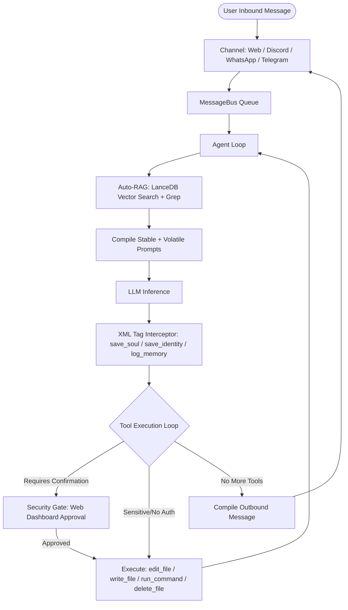

<div align="center">
  
</div>

# 🍋 LimeBot


> A persistent, self-evolving agentic AI that lives across your devices  with a soul, a memory, and a personality that's actually yours. Inspired by the powerful [OpenClaw](https://github.com/openclaw/openclaw) and the lightweight architecture of [Nanobot](https://github.com/HKUDS/nanobot).


[](https://opensource.org/licenses/MIT)
[](#-getting-started)
[](#-llm-support)
[](https://www.python.org/)
[](https://github.com/BerriAI/litellm)
[](#-privacy--security)

LimeBot is not a wrapper around an API. It's a full agentic system  event-driven, multi-channel, and built to remember who you are. It browses the web, manages your files, schedules reminders, spawns sub-agents for complex tasks, and evolves its personality through every conversation. All of it runs on your hardware.

---

## Start here (one command)

You need two apps on the computer: **Node.js 22.19 or newer** and **Python 3.11–3.14**. If either one is missing or too old, LimeBot will say so in plain language and tell you which installer to download. It will not dump a stack trace.

```bash
npm start
```

That is the whole first run. LimeBot installs what it needs, then opens the dashboard. In the wizard, pick a model and paste your API key. To also get a real browser (click, type, download files) in one step:

```bash
npm run lime-bot setup -- --recommended
npm start
```

If you do not use Git: download the project ZIP from [the GitHub page](https://github.com/Ethereal-Lemons/LimeBot-OS) (Code → Download ZIP), unzip it, install [Docker Desktop](https://www.docker.com/products/docker-desktop/), then in that folder run:

```bash
sh docker/prepare.sh
docker compose up --build -d
```

On Windows PowerShell use `powershell -ExecutionPolicy Bypass -File docker/prepare.ps1` instead of the `sh` line. Then open [http://localhost:3000](http://localhost:3000).

Details, optional extras, and developer commands are further down.

---

## 🏛️ How It Works (Architecture Overview)

LimeBot operates on an **event-driven agentic loop**. When you send a message, it flows through the system as follows:



---


## 🚀 Latest Updates (v1.0.3)
- **Discord Personalization:** Added per-guild/per-channel tone, verbosity, emoji usage, signatures, and embed theming.
- **GitHub Skill Defaults:** Automatic repo, base branch, PR templates, reviewers, labels, and push notifications.
- **Skill Dependencies & UI:** Visibility of required dependencies and missing-deps alerts in the UI.
- **Improved Reflection:** Skipping LLM reflection calls when no journal exists to prevent setup-time errors.
- **Themed Discord Embeds:** Upgraded tool outputs visually.

## ✨ What It Can Actually Do

### 🧠 It Remembers Everything
Three-tier memory system that persists across sessions:
- **Episodic Memory**  every conversation is appended to a daily markdown journal (`persona/memory/YYYY-MM-DD.md`)
- **Semantic Memory**  entries are embedded and stored in a local LanceDB vector database, enabling fuzzy recall of anything said weeks ago
- **Auto-RAG**  before every reply, LimeBot automatically searches its memory (semantically first, grep fallback) and injects relevant context into the prompt without you asking
- **Reflection Engine**  a background cron job runs every 4 hours, reads today's journal, and distills the key facts into a permanent `MEMORY.md` long-term essence file

### 👤 It Has a Real Persona
Not a hardcoded system prompt. A living identity that evolves:
- **`SOUL.md`**  core values, personality, and behavioral boundaries
- **`IDENTITY.md`**  name, emoji, avatar URL, style, catchphrases, interests, birthday
- **Local-first persona files**  first boot auto-creates starter `SOUL.md`, `IDENTITY.md`, and `MEMORY.md` from shipped `.example` templates so users get a clean bot without committing live persona state
- **Per-platform styles**  separate voice for Discord, WhatsApp, and Web
- **Per-user profiles**  builds a relationship profile for each person it talks to, tracking affinity scores, relationship level, in-jokes, and milestones
- **Dynamic Mood**  optional `MOOD.md` that shifts based on conversations and persists between sessions
- **Setup Interview**  if the local persona files are missing or invalid, the bot interviews you to rebuild its identity and saves the result automatically once it has enough to work with.

### 🌐 It Browses the Web
Full Playwright-powered browser automation:
- Navigate to any URL, click elements, fill forms, scroll pages
- `web_search()` for live web, news, and image lookup (the host parses results)
- Extract page text, take DOM snapshots, list all media on a page
- Download high-resolution images from Pinterest, Reddit, Wikimedia, direct URLs
- Results stream back in real time with progress updates in the dashboard

### 📁 It Has Access to Your Files
Whitelisted filesystem operations:
- Read, write, create, delete, move, rename files and directories
- Apply exact hash-guarded patches to existing UTF-8 files with `edit_file`; LimeBot previews the diff, rejects stale/no-op/overlapping edits, and runs read-only verification checks afterward
- Run optional `diagnose_files` checks with installed Ruff, Pyright, ESLint, or TypeScript tooling; missing providers return `skipped` and are never required for core verification
- All operations sandboxed to `ALLOWED_PATHS`  nothing outside those roots is touchable unless you explicitly allow it
- Dangerous operations (write, delete, run) require explicit confirmation through the web UI before executing

### ⚙️ It Can Run Commands
Secure subprocess execution with real-time output streaming:
- Runs shell commands inside the project root
- Shell injection filter blocks `;`, `&&`, `|`, backticks, `$()`, and env manipulation
- **Stall detection**  if a command produces no output for 30 seconds (likely waiting for interactive input), it's automatically terminated with guidance to retry using non-interactive flags
- Requires user confirmation via the dashboard before any command executes
- **Autonomous Mode**  optionally bypass all confirmation prompts for full hands-off operation
- **Session-based approval**  approve a tool once for the current session without enabling full autonomy

### 🕐 It Schedules Its Own Reminders
Persistent cron system:
- One-time reminders: `"remind me in 2 hours to call mom"`
- Repeating jobs: full cron expression support (`0 8 * * *`)
- Jobs survive restarts (persisted to `data/cron.json`)
- With Dynamic Personality enabled: automatic morning greetings and silence check-ins

### 🤖 It Can Spawn Sub-Agents
For complex multi-step tasks, LimeBot can delegate work to an isolated background agent:
- Sub-agent runs in its own session with its own tool loop
- Built-in specialist profiles like `reviewer`, `verifier`, and `explorer` can be recommended automatically when the request wording matches the task
- Custom subagents can also be suggested when their descriptions overlap strongly with the current request
- Reports back to the parent session when complete
- Coding, repository, review, and verification work defaults to a temporary copy-on-write workspace; the report includes a bounded structured diff and changes are not merged into the live project implicitly
- Use `isolation="copy"` to force isolation or `isolation="none"` only for an explicitly shared task
- The web chat renders delegated results as a dedicated sub-agent report card instead of raw trace text
- Useful for long-running research, file processing, or anything that shouldn't block the main conversation

LimeBot also exposes an authenticated local companion API at `/api/app/*` for inspecting durable workspaces, steering a workspace with messages, resolving approvals, and streaming normalized workspace events. It remains local-first and does not expose direct shell execution, credentials, artifact paths, or file-reading endpoints.

For CI review, `limebot review-diff --diff-file change.patch --output review.json` creates a capped, secret-redacted artifact. `.github/workflows/limebot-review.yml` is artifact-only with `contents: read`; model invocation is opt-in and it never posts PR comments, edits files, or pushes commits.

### 🔌 Model Context Protocol (MCP) Support
LimeBot is a fully-featured MCP client:
- **Universal Tool Integration**  connect to any MCP server (Fetch, Filesystem, Brave Search, etc.) to immediately expand the bot's capabilities.
- **Dynamic Discovery**  tools from connected MCP servers are automatically prefixed with `mcp_server_name_` and injected into the AI's tool registry.
- **Configurable Servers**  manage server arguments and environment variables directly from the web dashboard.
- **Safety & Resilience**  built-in timeouts and error handling ensure that misbehaving MCP servers don't hang the main agent loop.

---

## 📡 Channels

| Channel | How it works |
|---------|-------------|
| **Web Dashboard** | React + Vite UI connecting over WebSocket. Streams tokens as they arrive, shows live tool execution cards, confirmation prompts, thinking traces, and ghost activity indicators. **Includes a Custom CSS editor for global UI personalization.** |
| **Discord** | Full `discord.py` integration. Responds to DMs and `@mentions`. Configurable allow-list by user ID and channel ID. Custom presence status, activity type, and display name. |
| **WhatsApp** | Connects to a local `whatsapp-web.js` bridge over WebSocket. Contact approval whitelist with pending/blocked states. QR code displayed in the web dashboard for easy pairing. |
| **Telegram** | Bot API long-polling. Supports text send/receive, per-user allow-listing, optional per-chat allow-listing, typing indicators, and 4096-character chunking. |

### 🧩 Browser Companion Extension

LimeBot also ships with a browser companion extension for Chrome, Edge, and Opera GX.

- Ask LimeBot about the current page
- Send selected text to LimeBot
- View live task status and approvals while you browse
- Use the same LimeBot persona name and avatar when available

Setup instructions live in [extension/README.md](extension/README.md).

---

## 🤖 LLM Support

LimeBot uses [LiteLLM](https://github.com/BerriAI/litellm)  any model it supports, LimeBot supports:

| Provider | Example model string |
|----------|---------------------|
| **Gemini** (default) | `gemini/gemini-3.6-flash` |
| **OpenAI** | `openai/gpt-5.6-sol` |
| **Anthropic** | `anthropic/claude-opus-5` |
| **xAI** | `xai/grok-4.6` |
| **DeepSeek** | `deepseek/deepseek-v4-flash` |
| **Moonshot AI (Kimi)** | `moonshot/kimi-k3` |
| **Qwen (DashScope)** | `qwen/qwen3.5-plus` |
| **NVIDIA** | `nvidia/deepseek-ai/deepseek-v4-flash-0731` |
| **OpenRouter** | `openrouter/openai/gpt-5.6-sol` |
Switch models live from the web dashboard without restarting.

### 🛡️ AI Gateway & Proxy Support
LimeBot supports routing all LLM traffic through external security or caching middleware (like AI Gateway, Open Guardian, or Helicone):
- **`LLM_PROXY_URL`**  configure a global proxy URL in the dashboard or `.env`. This overrides the default base URL for all providers.
- **Provider Normalization**  LiteLLM handles the complex routing and header manipulation required to use custom gateways with cloud providers.

---

## 🧩 Skills

Skills extend what LimeBot can do. Each skill is a folder with a `SKILL.md` (the LLM instructions) and a `skill.py` or script (the execution logic).

**Built-in skills:**

| Skill | What it does |
|-------|-------------|
| `browser` | Full Playwright web browsing  navigate, click, type, search, extract |
| `download_image` | Download high-res images from Pinterest, Reddit, Wikimedia, or direct URLs |
| `filesystem` | Strategy guide for LimeBot's sandboxed file tools |
| `discord` | Optional higher-level Discord administration helpers |
| `docx-creator` | Create, inspect, edit, and validate Microsoft Word `.docx` documents |
| `scrapling` | Stealthy page extraction when the browser skill is not enough |
| `watch` | How to use the native `analyze_video` tool |

GitHub work is no longer a built-in LimeBot skill. Install the official Cursor plugin instead:

```bash
limebot plugin install cursor/plugins/github
# or from this repo's fixture / a local checkout:
limebot plugin install ./path/to/third_party/github
```

**Install community skills from GitHub:**
```bash
# Full URL
python -m core.skill_installer install https://github.com/user/my-lime-skill

# GitHub shorthand
python -m core.skill_installer install user/my-lime-skill

# Or via the CLI wrapper
npm run lime-bot skill install https://github.com/user/my-lime-skill
```

The installer auto-detects the repo's default branch, and automatically runs `pip install` or `npm install` if dependency files are present.

**Other skill commands:**
```bash
python -m core.skill_installer list
python -m core.skill_installer update <skill_name>
python -m core.skill_installer uninstall <skill_name>
python -m core.skill_installer enable <skill_name>
python -m core.skill_installer disable <skill_name>
```

Skills can also be managed from the **Skills** tab in the web dashboard.

### Cursor plugins

LimeBot understands the Cursor plugin package format (`.cursor-plugin/plugin.json`,
optional `marketplace.json`, `skills/*/SKILL.md`, `mcp.json`, and rules).

```bash
limebot plugin install cursor/plugins/create-plugin
limebot plugin install ./tests/fixtures/cursor-plugins/github
limebot plugin list
```

Installed plugins land under `$LIMEBOT_STATE_DIR/plugins`. Their skills are
loaded by the existing skill registry; their MCP servers are merged into
`mcp/mcp_config.json`.

---

## 🚀 Getting Started

The short path is at the top of this file. This section is the same flow with
more detail.

### Before you start

Install these two apps if you do not already have them:

- [Node.js](https://nodejs.org) 22.19 or newer (the website calls this the LTS installer)
- [Python](https://www.python.org/downloads/) 3.11 through 3.14 (on Windows, tick "Add python.exe to PATH")

You also need about 1 GB free and an API key from any supported model provider.
You do **not** need to create a virtual environment or run `npm install` yourself.

If `npm start` says Node or Python is wrong, follow the numbered steps it prints.
Close the terminal, open a new one, and try `npm start` again.

### Quick Start

1. Open a terminal in the LimeBot folder (clone with Git, or unzip the GitHub download).

2. Optional but recommended — install a real browser so LimeBot can click and download files:

   ```bash
   npm run lime-bot setup -- --recommended
   ```

3. Start LimeBot:

   ```bash
   npm start
   ```

   The first run creates `.venv`, installs core dependencies, and opens the dashboard.

4. Open [http://localhost:5173](http://localhost:5173) if it does not open itself.

5. In the setup wizard, choose a model and paste its key. Keys stay in the local `.env` file.

6. Send a first message. LimeBot will ask a few persona questions and write `SOUL.md` and `IDENTITY.md`.

After one successful start, `npm run start:quick` is the fastest warm start.

### What gets installed

The default installation is enough for web chat, the dashboard, Discord, core
tools, scheduling, and supported LLM providers. Large or specialized features
are opt-in, so a new user does not download them before reaching setup.

### Optional features

Install only what you use. Sizes are rough ranges and vary by platform and cache.

After one successful normal start, install every optional profile plus a
launch-verified Chromium browser with:

```bash
npm run lime-bot feature install all
```

The command is retryable: profiles already recorded with unchanged manifests
are skipped. If one installation fails, fix the reported issue and run the
same command again.

| Feature | Command | Approximate extra disk |
|---|---|---:|
| Browser Python support | `npm run lime-bot feature install browser` | 20-50 MB before Chromium |
| Browser + launch-verified Chromium | `npm run install-browser` | 300-700 MB |
| Semantic memory (LanceDB) | `npm run lime-bot feature install memory` | 100-300 MB |
| Word/PDF helpers | `npm run lime-bot feature install documents` | 10-30 MB |
| MCP integration | `npm run lime-bot feature install mcp` | 10-30 MB |
| Video analysis (`yt-dlp`, Pillow, FFmpeg checks) | `npm run lime-bot feature install video` | 100-300 MB |
| WhatsApp bridge | `npm run lime-bot feature install whatsapp` | 200-500 MB |
| Browser companion build tools | `npm run lime-bot feature install extension` | 100-300 MB |
| All optional features + Chromium | `npm run lime-bot feature install all` | Platform-dependent |

WhatsApp is installed and built automatically before its first launch.
`npm run extension:build` installs the extension workspace before building it.
If an optional package is absent, only that capability is unavailable; core
chat still starts.

Video analysis accepts allowed local files and public, unauthenticated HTTP(S)
media. It rejects playlists, livestreams, private network destinations, media
over two hours, and downloads over 500 MiB. Enable the separately installed
`watch` skill to teach the model its `/watch` workflow. Native captions are
preferred. `VIDEO_WHISPER_ENABLED=false` keeps caption-less audio local; when
enabled, that audio is sent to OpenAI using the configured `OPENAI_API_KEY`.

The video installer verifies both `ffmpeg` and `ffprobe`. If they are missing,
install FFmpeg with `winget install --id Gyan.FFmpeg -e` (Windows),
`brew install ffmpeg` (macOS), or your Linux package manager, then retry.

### First-run troubleshooting

Run the built-in diagnostic first:

```bash
npm run doctor
```

Common cases:

- **Node is rejected before installation:** install Node.js 22.19 or newer,
  open a new terminal, and run `node --version` again.
- **Python is rejected:** install Python 3.11-3.14. On Windows, the `py`
  launcher helps LimeBot find a supported installation.
- **An interrupted `.venv` is detected:** LimeBot preserves the old directory
  as `.venv.incomplete-<timestamp>`, creates a replacement, and restores the
  preserved directory if repair fails. It never falls back to system pip.
- **`spawn EINVAL` while starting npm on Windows:** update to the latest
  LimeBot checkout. Current releases route Windows `.cmd` shims through
  `cmd.exe` without enabling shell mode. Then rerun `npm start`.
- **A dependency lane fails:** the other lane is allowed to finish, but LimeBot
  will not start or record the failed lane as current. Fix the reported error
  and rerun `npm start`; successful work is reused.
- **The UI opens but input is temporarily disabled:** the process is live, but
  required skills/tools are still loading. The readiness banner will update
  automatically.

For more detail, use `npm run logs`. Use `npm run start:quick` only after a
normal start has completed successfully.

### Browser Companion Setup

Once LimeBot is running, you can also build and load the browser companion extension:

```bash
npm run extension:build
```

Load the unpacked extension from `extension/dist`. Full setup steps are in [extension/README.md](extension/README.md).

### 🛠️ CLI Command Reference

You can use the following commands in the root directory to manage your LimeBot instance:

| Command | Description |
|---------|-------------|
| **`npm start`** | Recommended start command; installs/refreshes only changed core dependencies, then launches backend and frontend. |
| **`npm run start:quick`** | Launches with dependency and update checks skipped; use this only after a successful normal start. |
| **`npm run stop`** | Safely stops all active LimeBot background processes. |
| **`npm run status`** | Checks active ports (Backend on `8000`, Frontend on `5173`). |
| **`npm run update`** | Safely fast-forwards a Git checkout, backs up runtime state, and refreshes dependencies. |
| **`npm run update:check`** | Shows update availability and whether local changes can be updated automatically. |
| **`npm run lime-bot update --rollback`** | Reverts the last guarded update when no tracked source edits are present. |
| **`npm run doctor`** | Validates your local setup, environment variables, Node.js and Python runtimes. |
| **`npm run logs`** | Tails the live logger (`logs/limebot.log`). |
| **`npm run test:cli`** | Runs the Node.js CLI & dependency validation tests. |
| **`npm run install-browser`** | Manually downloads the browser binaries required for Playwright automation. |
| **`npm run lime-bot feature install <name>`** | Installs one optional profile and skips it when unchanged; use `all` for every profile plus Chromium. |
| **`npm run lime-bot skill list`** | Lists all installed and available skills. |
| **`npm run lime-bot skill install <url>`** | Installs a new skill from a GitHub URL or repository path. |

Normal combined startup opens the dashboard as soon as the backend reports process liveness at `/api/live`. Agent capabilities may continue loading after the UI appears; the authenticated `/api/ready` endpoint remains the source of full capability readiness. Remote update discovery also runs in the background after local processes launch. Backend-only startup continues to wait for full readiness so it can report a diagnostic result.

#### Hassle-free updates

Run `npm run update` from the checkout. The updater only applies a
fast-forward, refuses to overwrite tracked source edits, and preserves legacy
runtime files such as `.env`, `limebot.json`, persona data, and custom skills.
Before changing source it writes a local backup under
`.limebot-update-backups/`. If a dependency refresh is unavailable, the next
normal `npm start` retries it automatically. Use `--no-deps` to defer the
refresh explicitly, or `--rollback` to restore the previous guarded commit.

For new installs, set `LIMEBOT_STATE_DIR` to a user-owned directory outside the
Git checkout. LimeBot then stores mutable configuration, persona data, and
installed skills there, so future updates do not create merge conflicts with
local state. Existing installs can adopt this path incrementally; the checkout
root remains the compatibility default when the variable is not set.

### Manual Start (Developers)
```bash
# Terminal 1  Backend
cp .env.example .env   # fill in your keys
python -m pip install -r requirements-dev.txt
python main.py

# Terminal 2  Frontend
cd web && npm install && npm run dev
```

### Docker

**I don't use Git.** Install [Docker Desktop](https://www.docker.com/products/docker-desktop/). On the [LimeBot GitHub page](https://github.com/Ethereal-Lemons/LimeBot-OS) click **Code → Download ZIP**, unzip it, and open a terminal in that folder. Then run the two commands below. Open [http://localhost:3000](http://localhost:3000) when Docker says the stack is up.

Prepare the ignored runtime files once, then build the core stack:

```bash
# macOS / Linux / Git Bash
sh docker/prepare.sh
docker compose up --build -d
```

```powershell
# Windows PowerShell
powershell -ExecutionPolicy Bypass -File docker/prepare.ps1
docker compose up --build -d
```

Open [http://localhost:3000](http://localhost:3000). Nginx is the only host
entry point; it proxies API, generated media, and WebSocket traffic to the
private backend. Compose binds Nginx to `127.0.0.1` by default.

The image is core-only by default. To bake optional Python profiles or
Chromium into the backend image, set these values in `.env` before building:

```bash
LIMEBOT_DOCKER_FEATURES="memory documents mcp"
LIMEBOT_DOCKER_INSTALL_BROWSER=1
```

WhatsApp is an optional Compose profile. Set `ENABLE_WHATSAPP=true` in `.env`,
then start it with:

```bash
docker compose --profile whatsapp up --build -d
```

Useful commands:

```bash
docker compose ps
docker compose logs -f backend
docker compose down
```

### 24/7 deploy

Durable jobs are written to `data/jobs.sqlite` before the agent runs. A crash
re-queues interrupted work; cron is marked `ok` only after the agent turn
finishes. Live chat stays confirmation-gated, including after a restart.
Scheduled or explicitly unattended jobs use:

```env
UNATTENDED_PATH_ALLOWLIST=./persona,./temp,./logs
UNATTENDED_COMMAND_ALLOWLIST=python,gh
```

Supervise the process so recovery can actually happen:

```bash
# Linux host
limebot autorun enable
# or install deploy/systemd/limebot.service and point WorkingDirectory at your checkout

# Heartbeat
curl -fsS http://127.0.0.1:8000/api/live
```

Docker already uses `restart: unless-stopped`. See [deploy/systemd/README.md](deploy/systemd/README.md).

The backend port is intentionally not published. Do not publish it while
`LIMEBOT_TRUSTED_PROXY_ONLY=true` unless `APP_API_KEY` is also configured.
To expose the dashboard on a LAN, set `LIMEBOT_DOCKER_BIND_HOST=0.0.0.0` and a
strong `APP_API_KEY` in `.env`, then rebuild/restart the stack.

### Codex OAuth (CLI-only)
LimeBot can now store and manage ChatGPT Codex OAuth locally through the CLI without putting the login flow in the web dashboard.

```bash
limebot auth codex login
limebot auth codex import
limebot auth codex status
limebot auth codex logout
```

- `login` starts the browser-based ChatGPT OAuth flow using the local CLI
- `import` pulls an existing login from `%USERPROFILE%\.codex\auth.json` (or `CODEX_HOME/auth.json`)
- credentials are stored locally in `data/oauth_profiles.json`
- the dashboard can read status, but sign-in itself stays CLI-only

---

## ⚙️ Configuration

Copy `.env.example` to `.env`:

```env
# Core
LLM_MODEL=gemini/gemini-3.6-flash
GEMINI_API_KEY=your_key_here
DASHSCOPE_API_KEY=your_dashscope_key_here
# Optional for Qwen region routing:
# LLM_BASE_URL=https://dashscope-intl.aliyuncs.com/compatible-mode/v1

# Channels (all optional)
DISCORD_TOKEN=your_discord_bot_token
ENABLE_WHATSAPP=false
WEB_PORT=8000
FRONTEND_PORT=5173

# Security
ALLOWED_PATHS=./persona,./logs,./temp
APP_API_KEY=optional_dashboard_password

# Features
ENABLE_DYNAMIC_PERSONALITY=false   # per-user affinity, mood tracking, proactive greetings
VIDEO_WHISPER_ENABLED=false        # opt in to sending caption-less audio to OpenAI Whisper
LLM_PROXY_URL=http://localhost:8080/v1 # Optional: Route all traffic through a gateway
```

LimeBot defaults to the `fast` AI harness: Auto-RAG gets an 80ms request
budget, and casual turns such as greetings do not receive tools. Explicit
actions, URLs, paths, and slash commands still do. Set
`LIMEBOT_AI_HARNESS_MODE=balanced` to use a 200ms Auto-RAG budget instead.
Request-specific tool shortlisting remains opt-in through
`LIMEBOT_ENABLE_TOOL_SHORTLIST=true`. Set
`LIMEBOT_FAST_DISABLE_TOOLS_FOR_CASUAL=false` only when tools are needed on
every non-empty turn. These settings reduce LimeBot-side preparation and
prevent accidental actions; they do not change provider generation speed.

> [!TIP]
> **No manual editing required!** You can modify all environment settings live from the **Config** tab in the web dashboard. Your changes will automatically overwrite the `.env` file and trigger a clean backend restart.

---

## 🛡️ Privacy & Security

- **Local-first**  all conversations, memories, and personal data stay on your machine.
- **Sandboxed Filesystem**  LimeBot can only read/write files in directories you explicitly whitelist.
- **Human-in-the-loop**  sensitive actions (running shell commands, modifying/deleting files) require your explicit approval.
  > [!IMPORTANT]
  > By default, dangerous actions in live chat pause for dashboard approval.
  > Scheduled or explicitly unattended jobs use `UNATTENDED_PATH_ALLOWLIST` /
  > `UNATTENDED_COMMAND_ALLOWLIST` instead of forcing `AUTONOMOUS_MODE=true`.
- **Open Source**  audit the code yourself. No hidden telemetry.

---

## 🤝 Contributing

We love contributions! Please check out [CONTRIBUTING.md](CONTRIBUTING.md) for guidelines on how to submit PRs, report bugs, or request features.

---

## 📄 License

MIT © [LemonMantis5571](https://github.com/LemonMantis5571)
